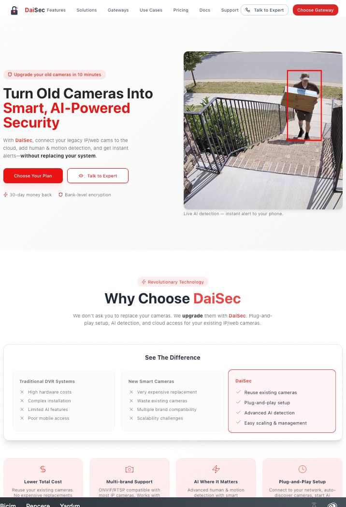
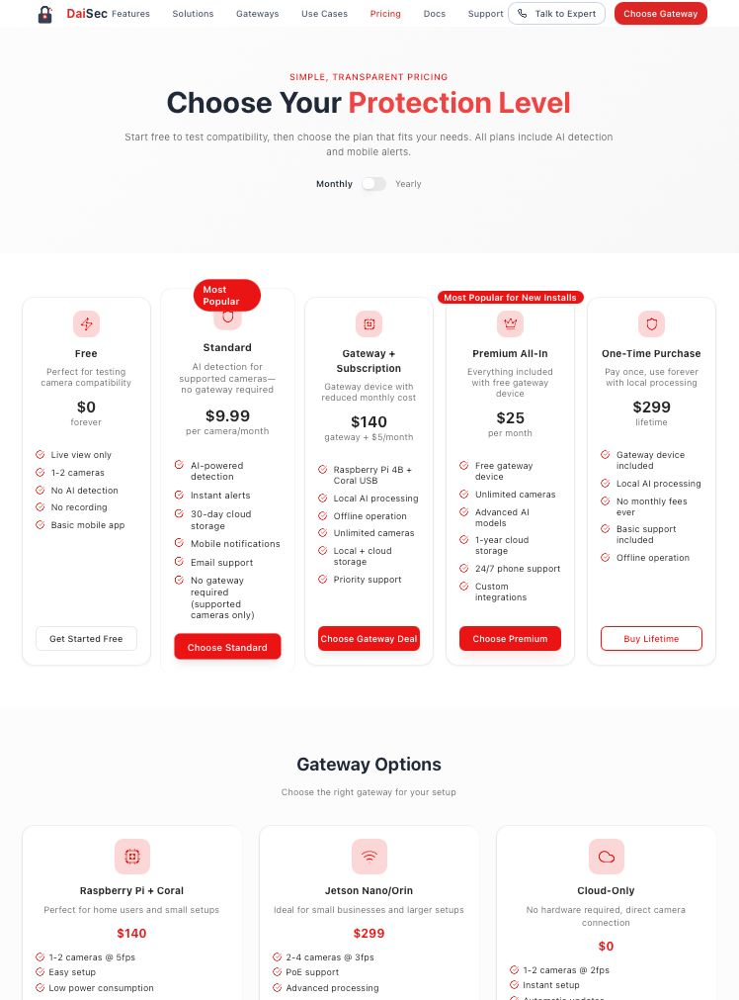
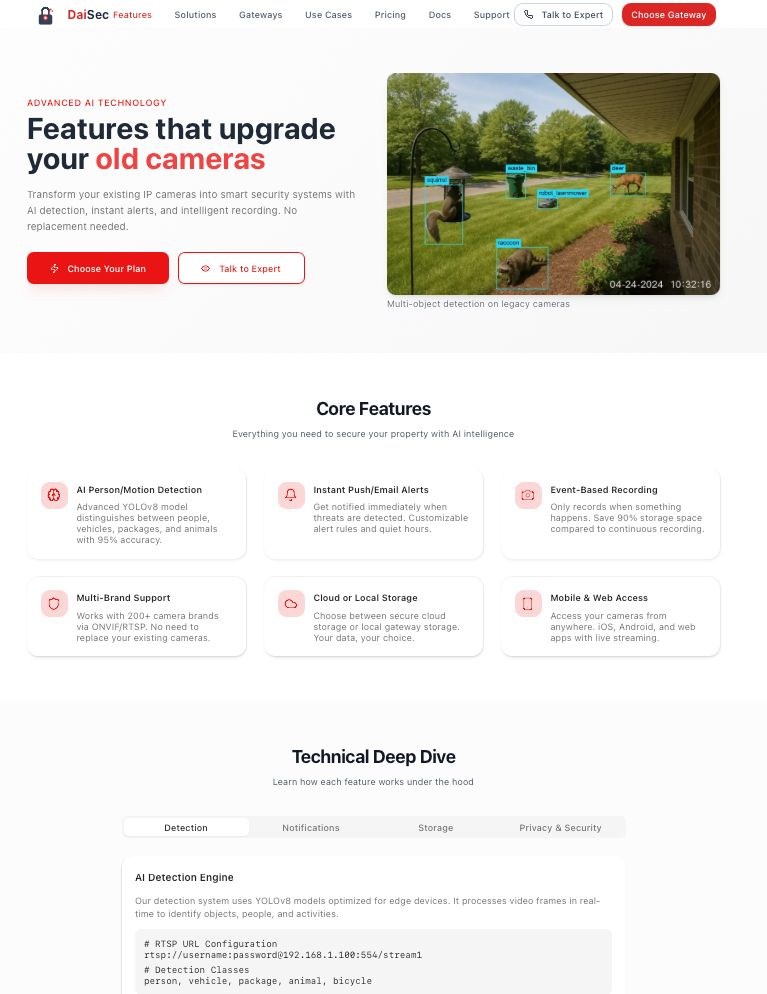
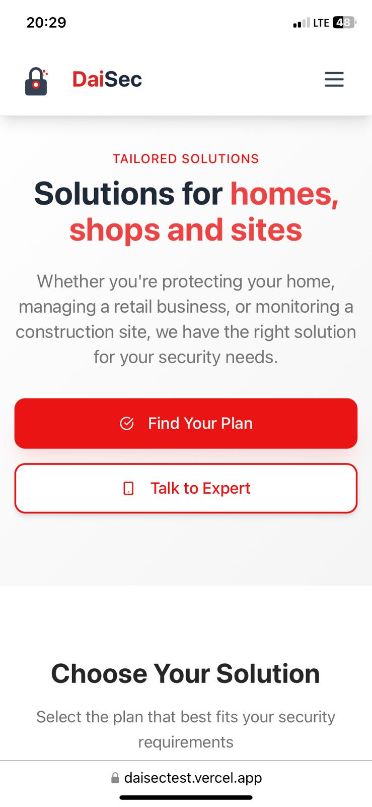
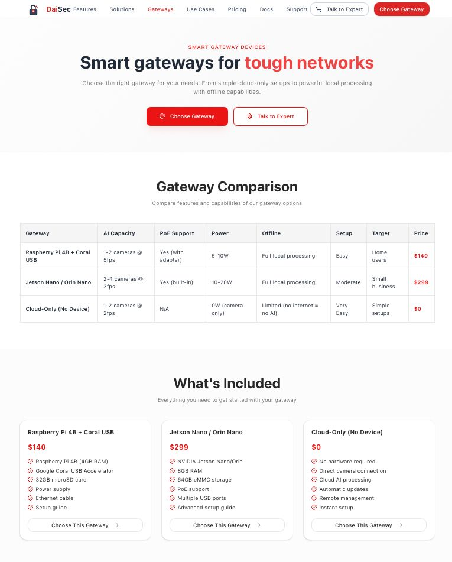

# 🔒 DaiSec

**Turn old cameras into smart, AI-powered security in minutes** 🚀

[](https://opensource.org/licenses/MIT)
[](https://vercel.com/new/clone?repository-url=https://github.com/berkaynez/daisec-web-project)
[](https://reactjs.org/)
[](https://tailwindcss.com/)

---

## Overview

DaiSec transforms your existing IP and web cameras into intelligent security systems with AI-powered human and motion detection, cloud recording, and instant alerts. Instead of expensive camera replacements, we provide smart technology that works with what you already have, delivering professional-grade security at a fraction of the cost.

## ✨ Unique Value Proposition

- **♻️ Reuse Existing Cameras** - No need to replace your current IP/web cameras
- **🤖 AI-Powered Detection** - Advanced human and motion detection with 95% accuracy
- **☁️ Flexible Deployment** - Choose between cloud-only or gateway-based solutions
- **💰 Cost-Effective** - Save thousands compared to traditional security upgrades

## 🚀 Features

### 🧠 AI-Powered Intelligence
- **Human Detection** - Distinguish between people, pets, and objects
- **Motion Analysis** - Smart filtering to reduce false alarms by 95%
- **Real-time Processing** - Instant alerts with HD video evidence

### 🔗 Universal Compatibility
- **Multi-brand Support** - Works with 200+ camera brands
- **ONVIF/RTSP Protocol** - Industry-standard connectivity
- **Legacy Camera Support** - Upgrade cameras from any era

### 📹 Smart Recording & Storage
- **Event-based Recording** - Only records when something happens
- **Cloud Storage** - Secure, scalable cloud storage options
- **Local Processing** - Gateway-based local AI processing

### 🎯 Easy Management
- **Mobile & Web Dashboard** - Monitor from anywhere, anytime
- **Centralized Control** - Manage all cameras from one interface
- **Role-based Access** - Secure multi-user management

## 🏗️ Architecture

DaiSec offers two flexible deployment models:

```
┌─────────────────────────────────────────────────────────────┐
│                    DaiSec Architecture                      │
├─────────────────────────────────────────────────────────────┤
│                                                             │
│  📱 Mobile App  │  💻 Web Dashboard  │  🔗 API Access      │
│                                                             │
├─────────────────────────────────────────────────────────────┤
│                                                             │
│  ☁️  Cloud-Only Model          │  🏠 Gateway Model          │
│  ┌─────────────────┐           │  ┌─────────────────┐       │
│  │   Your Cameras  │ ──────────┼─→│  Smart Gateway  │       │
│  │  (IP/Web/RTSP)  │           │  │ (Raspberry Pi)  │       │
│  └─────────────────┘           │  └─────────────────┘       │
│           │                    │           │                │
│           ▼                    │           ▼                │
│  ┌─────────────────┐           │  ┌─────────────────┐       │
│  │  Cloud AI       │           │  │  Local AI       │       │
│  │  Processing     │           │  │  Processing     │       │
│  └─────────────────┘           │  └─────────────────┘       │
│                                                             │
└─────────────────────────────────────────────────────────────┘
```

### Deployment Models

**☁️ Cloud-Only Model**
- Direct camera-to-cloud connection
- No hardware required
- Perfect for supported cameras
- Instant setup and scaling

**🏠 Gateway Model**
- Raspberry Pi 4B + Coral USB accelerator
- Local AI processing
- Works with ANY camera brand
- Offline capability

## 💰 Pricing Models

| Plan | Price | Best For | Key Features |
|------|-------|----------|--------------|
| **🆓 Free** | $0/month | Testing & small setups | Live view, 1-2 cameras, basic app |
| **⚡ Standard** | $14.99/camera/month | Existing camera owners | AI detection, event recording, cloud storage |
| **🏠 Gateway + Sub** | $140 + $5/month | Multi-brand setups | Smart gateway, unlimited cameras, local AI |
| **👑 Premium All-In** | $0 hardware + $25/month | New installations | Free gateway, premium hardware, 24/7 support |

*All plans include 30-day money-back guarantee*

## 📸 Screenshots

### 🏠 Landing Page

*Modern, responsive landing page showcasing DaiSec's value proposition*

### 💰 Pricing Page

*Clear pricing comparison with flexible plans for different needs*

### 🤖 AI Detection Example

*Real-time AI detection showing person and package identification*

### 📱 Mobile Dashboard

*Mobile-optimized interface for monitoring on the go*

### ⚙️ Gateway Setup

*Simple plug-and-play gateway configuration process*

## 🔗 Live Demo

**🔗 [Live Demo on Vercel](https://daisectest.vercel.app)**

Experience DaiSec's modern interface and explore all features in action.

---

## 📄 License

This project is licensed under the MIT License.

```
MIT License

Copyright (c) 2025 DaiSec

Permission is hereby granted, free of charge, to any person obtaining a copy
of this software and associated documentation files (the "Software"), to deal
in the Software without restriction, including without limitation the rights
to use, copy, modify, merge, publish, distribute, sublicense, and/or sell
copies of the Software, and to permit persons to whom the Software is
furnished to do so, subject to the following conditions:

The above copyright notice and this permission notice shall be included in all
copies or substantial portions of the Software.

THE SOFTWARE IS PROVIDED "AS IS", WITHOUT WARRANTY OF ANY KIND, EXPRESS OR
IMPLIED, INCLUDING BUT NOT LIMITED TO THE WARRANTIES OF MERCHANTABILITY,
FITNESS FOR A PARTICULAR PURPOSE AND NONINFRINGEMENT. IN NO EVENT SHALL THE
AUTHORS OR COPYRIGHT HOLDERS BE LIABLE FOR ANY CLAIM, DAMAGES OR OTHER
LIABILITY, WHETHER IN AN ACTION OF CONTRACT, TORT OR OTHERWISE, ARISING FROM,
OUT OF OR IN CONNECTION WITH THE SOFTWARE OR THE USE OR OTHER DEALINGS IN THE
SOFTWARE.
```

---